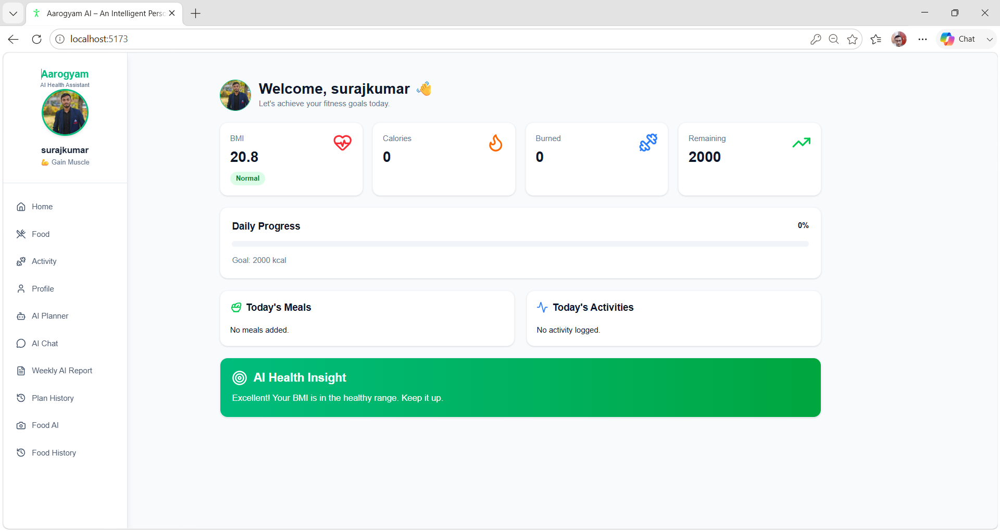
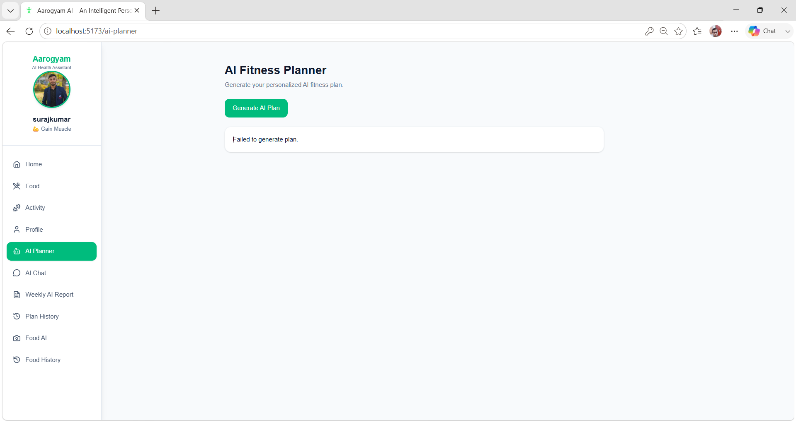
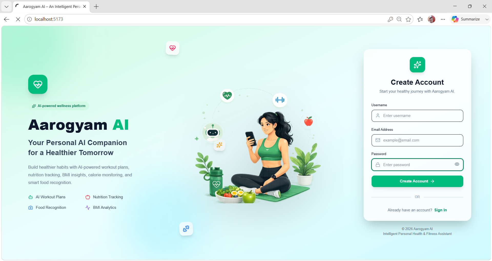
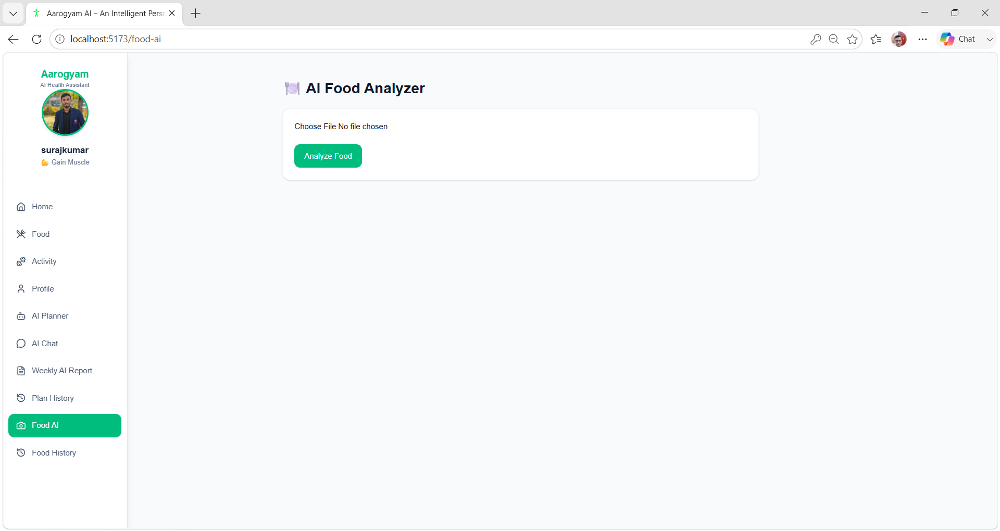
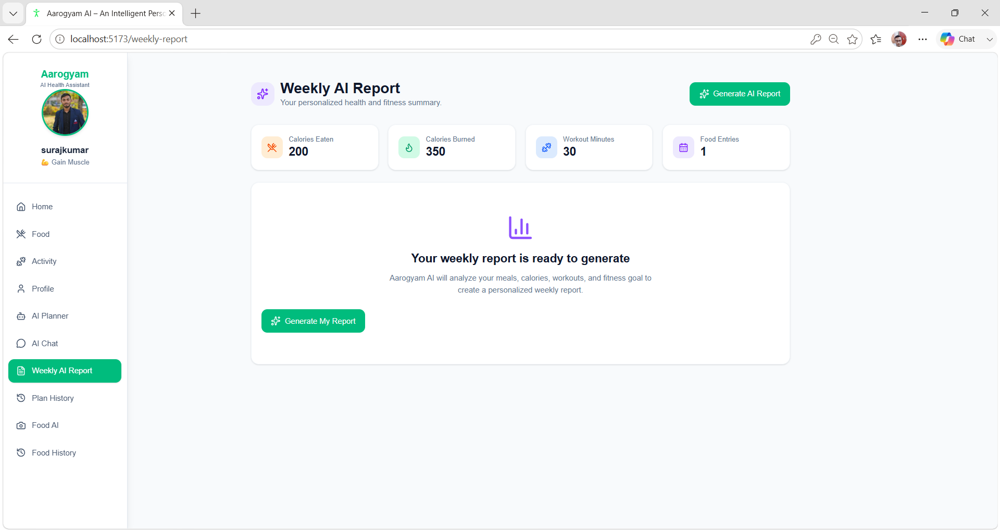
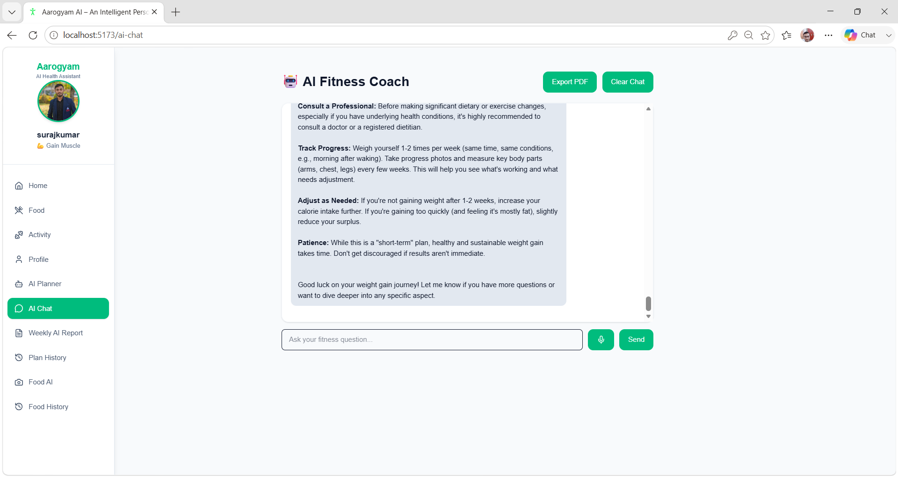
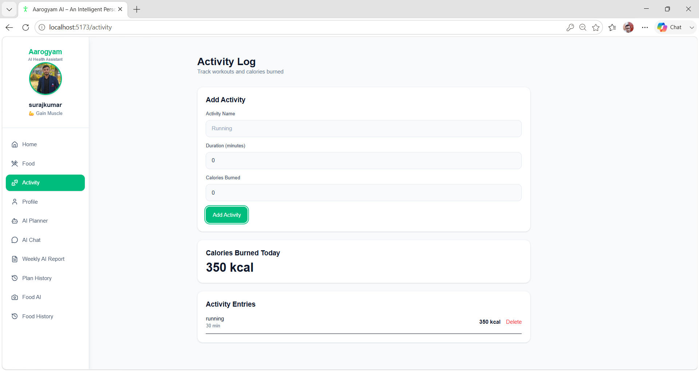
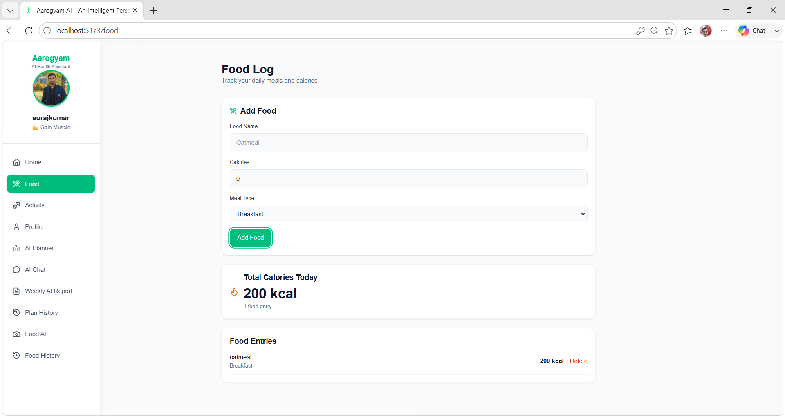
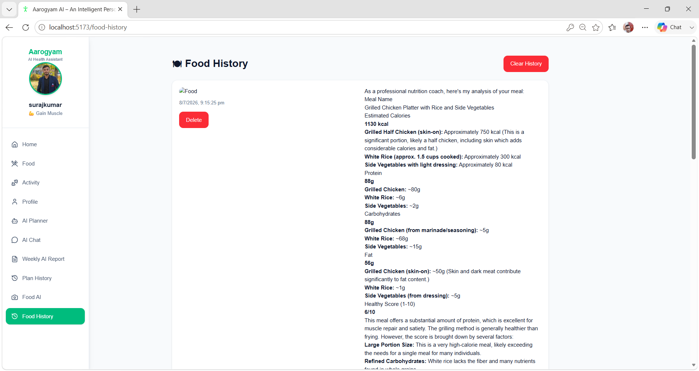
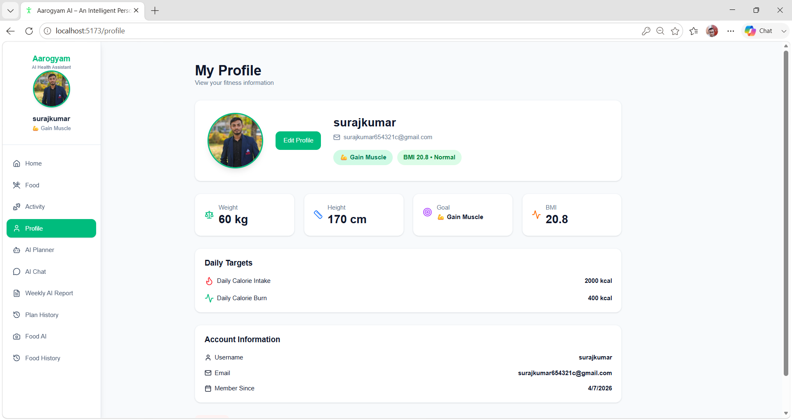

# Aarogyam AI

Aarogyam AI is an intelligent health and fitness web application that helps users track meals, physical activities, personal fitness goals, and weekly health progress.

It combines a modern React frontend, a Node.js backend, MongoDB database storage, JWT authentication, and Google Gemini AI for food image analysis and weekly health reports.
# 📸 Application Screenshots

## Home Page

## Ai planner

## Dashboard

## AI Food Analyzer

## Weekly Report

## Fitness Coach

## Activity 

## FoodLog

## Food History 

## Profile

## Features

* User signup and login
* JWT authentication for secure user accounts
* Password hashing using bcrypt
* User onboarding with age, weight, height, and fitness goal
* Food log management
* Activity log management
* AI food image analysis
* Weekly AI health report
* MongoDB database storage
* Protected API routes
* Responsive interface for mobile, tablet, and desktop

## Technology Stack

### Frontend

* React
* TypeScript
* Vite
* Tailwind CSS
* Axios
* React Router DOM
* React Hot Toast
* React Markdown
* Lucide React

### Backend

* Node.js
* Express.js
* MongoDB
* Mongoose
* JSON Web Token (JWT)
* bcrypt
* Multer
* Google Gemini AI API
* dotenv
* CORS

## Project Structure

Aarogyam-AI/
│
├── frontend/
│   ├── src/
│   │   ├── components/
│   │   ├── context/
│   │   ├── pages/
│   │   ├── services/
│   │   ├── types/
│   │   ├── App.tsx
│   │   └── main.tsx
│   └── package.json
│
├── backend/
│   ├── controllers/
│   ├── middleware/
│   ├── models/
│   ├── routes/
│   ├── server.js
│   ├── package.json
│   └── .env
│
└── README.md

## Main Modules

### Authentication

Users can create an account and log in securely.

During signup, passwords are hashed using bcrypt before being stored in MongoDB. During login, the backend verifies the password and returns a JWT token.

The frontend saves the JWT token in `localStorage`.

Protected API requests use:

Authorization: Bearer JWT_TOKEN
The backend authentication middleware verifies the token and identifies the logged-in user.

### User Onboarding

After signup, users complete onboarding by entering:

* Age
* Weight
* Height
* Fitness goal
* Daily calorie intake target
* Daily calorie burn target

The available fitness goals are:

* Lose weight
* Maintain weight
* Gain muscle

### Food Logs

Users can add, view, and delete food entries.

Each food log contains:

* Food name
* Calories
* Meal type
* Date
* User ID

Food API routes:
POST /api/food
GET /api/food
DELETE /api/food/:id

### Activity Logs

Users can add, view, and delete physical activities.

Each activity log contains:

* Activity name
* Duration
* Calories burned
* Date
* User ID

Activity API routes:

POST /api/activity
GET /api/activity
DELETE /api/activity/:id

### AI Food Image Analysis

Users can upload a food image and receive AI-generated nutrition information.

The image is uploaded using Multer and sent from the backend to Google Gemini AI.

The AI response includes:

* Meal name
* Estimated calories
* Protein
* Carbohydrates
* Fat
* Healthy score
* Suggestions

Image analysis route:

POST /api/image/analyze-food

### Weekly AI Health Report

The Weekly AI Health Report analyzes the user's food logs and activity logs from the previous seven days.

It provides:

* Weekly calorie intake summary
* Calories burned summary
* Nutrition habits analysis
* Exercise consistency
* Positive health habits
* Areas for improvement
* Personalized AI suggestions
* Weekly health score

The report is generated using user data stored in MongoDB and Google Gemini AI.

## Installation

### 1. Clone the repository

git clone https://github.com/jaiswal-suraj12/Aarogyam-AI
cd aarogyam-ai

### 2. Install frontend dependencies

cd frontend
npm install

### 3. Install backend dependencies

cd ../backend
npm install

## Environment Variables

Create a `.env` file inside the `backend` folder:

PORT=5000
MONGODB_URI=mongodb://127.0.0.1:27017/aarogyam_ai
JWT_SECRET=your_jwt_secret
GEMINI_API_KEY=your_gemini_api_key

Create a `.gitignore` file inside the backend folder:

node_modules
.env

## Run the Project

### Start MongoDB

Make sure MongoDB is running locally.

### Start backend
cd backend
npm run dev

Or:
nodemon server.js

The backend runs on:
http://localhost:5000

### Start frontend

Open another terminal:
cd frontend
npm run dev

The frontend usually runs on:
http://localhost:5173

## API Authentication Example

For protected routes, add the token in request headers:

Authorization: Bearer your_jwt_token_here

Example request body for adding food:

{
  "name": "Vegetable Salad",
  "calories": 250,
  "mealType": "lunch",
  "date": "2026-07-10"
}

Example request body for adding activity:

{
  "name": "Running",
  "duration": 30,
  "calories": 300,
  "date": "2026-07-10"
}

## System Architecture

React Frontend
      ↓
Express Backend API
      ↓
JWT Authentication Middleware
      ↓
Controllers
      ↓
MongoDB Database

For AI image analysis:

React Frontend
      ↓
Express Backend
      ↓
Multer Image Upload
      ↓
Google Gemini AI
      ↓
Nutrition Analysis Result

## Future Enhancements

* AI nutrition coach
* Personalized workout recommendation
* Grocery list generator
* Progress prediction
* Charts and analytics
* Notifications and reminders
* Calendar integration
* Cloud image storage
* Wearable device integration
* Admin dashboard
* Production deployment

## Author

Developed as a full-stack health and fitness management project using React, Node.js, Express, MongoDB, JWT, and Google Gemini AI.
